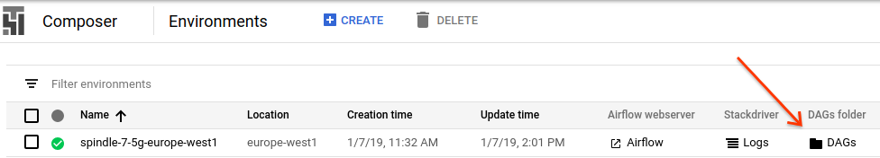
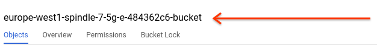
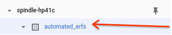
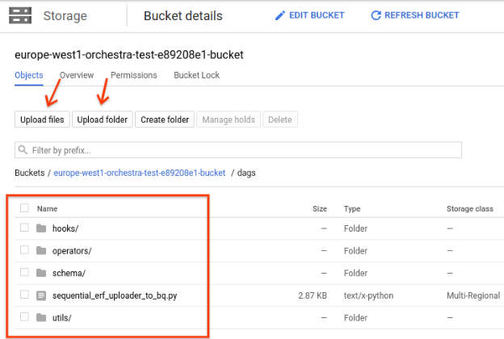

# Orchestra

**Orchestra is not an official Google Product**
- [Overview ](#overview)
- [Setting up your Orchestra environment in GCP](#setting-up-your-orchestra-environment-in-gcp)
    - [Billing](#billing)
    - [APIs](#apis)
    - [Create a Composer environment](#create-a-composer-environment)
- [Service Accounts](#service-accounts)
    - [Setting up a service account](#setting-up-a-service-account)
    - [Default Service Account](#default-service-account)
    - [Creating a new user for your service account in DV360](#creating-a-new-user-for-your-service-account-in-dv360)
    - [Multiple Partners](#multiple-partners)
- [Configuring Orchestra](#configuring-orchestra)
    - [Variables](#variables)
    - [Adding Workflows](#adding-workflows)
- [Additional info](#additional-info)
    - [Deleting an environment](#deleting-an-environment)

# Overview
**_Composer_** is a Google Cloud managed version of [Apache Airflow](https://airflow.apache.org/), an open source project for managing ETL workflows. We use it for this solution as you are able to deploy your code to production simply by moving files to Google Cloud Storage. It also provides Monitoring, Logging and software installation, updates and bug fixes for Airflow are fully managed.

It is recommended that you install this solution through the Google Cloud Platform UI.

We recommend familiarising yourself with Composer [here](https://cloud.google.com/composer/docs/).

**_Orchestra_** is an open source project, built on top of Composer, that is custom operators for Airflow designed to solve the needs of Advertisers.

Orchestra lets Enterprise Clients build their Advertising Data Lake out of the box and customize it to their needs

Orchestra lets sophisticated clients automate workflows at scale for huge efficiency gains.

Orchestra is a fully open sourced Solution Toolkit for building enterprise data solutions on Airflow.

# Setting up your Orchestra environment in GCP

### Billing
Composer and Big Query - two of the main Google Cloud Platform tools which Orchestra is based on - will require a GCP Project with a valid billing account.

See [this article](https://cloud.google.com/billing/docs/how-to/manage-billing-account) for more information Google Cloud Billing.

### APIs
In you GCP Project menu (or directly through [this link](https://console.cloud.google.com/apis/library?project=_&_ga=2.115478214.-1781341949.1549548145)) access the API Library so that you can enable the following APIs:

*   Cloud Composer
*   Cloud Dataproc
*   Cloud Storage APIs
*   BigQuery

### Create a Composer environment
[Follow these steps to create a Composer environment](https://cloud.google.com/composer/docs/how-to/managing/creating) in Google Cloud Platform - please note that it can take up to 20/30 minutes.

Environment Variables, Tags and Configuration Properties (airflow.cfg) can all be left as standard and you can use the default values for number of nodes, machine types and disk size (you can use a smaller disk size if you want to save some costs).

# Service Accounts

### Setting up a service account
Google Cloud uses service accounts to automate tasks between services. This includes other Google services such as DV360 and CM.

You can see full documentation for Service Accounts here:

https://cloud.google.com/iam/docs/service-accounts

### Default Service Account
By default you will see in the IAM section of your Project a default service account for Composer ("Cloud Composer Service Agent") and a default service account for Compute Engine ("Compute Engine default service account") - with their respective email addresses.

These service accounts have access to all Cloud APIs enabled for your project, making them a good fit for Orchestra. We recommend you use in particular the Compute Engine Service Account (i.e. "Compute Engine default service account" because it is the one used by the individual Compute Engine virtual machines that will run your tasks) as the main "Orchestra" service account.

If you wish to use another account, you will have to give it access to BigQuery and full permissions for the Storage APIs.

### Creating a new user for your service account in DV360
Your Service Account will need to be setup as a DV360 user so that it can access the required data from your DV360 account.

You need to have partner-level access to your DV360 account to be able to add a new user; [follow the simple steps to create a new user in DV360](https://support.google.com/displayvideo/answer/2723011?hl=en), using this configuration:

*   Give this user **the email of the service account you wish to use**.
*   Select all the advertisers you want to be able to access
*   Give** Read&Write** permissions
*   Save!

# Configuring Orchestra
You have now set up the Composer environment in GCP and granted the proper permissions to its default Service Account. \
You're ready to configure Orchestra!

### Variables
The Orchestra project will require several variables to run.

These can be set via the **Admin** section in the **Airflow UI** (accessible from the list of Composer Environments, clicking on the corresponding link under "Airflow Web server").

<table>
  <tr>
   <td><strong>Area</strong>
   </td>
   <td><strong>Variable Name</strong>
   </td>
   <td><strong>Value</strong>
   </td>
   <td><strong>Needed For</strong>
   </td>
  </tr>
  <tr>
   <td>Cloud Project
   </td>
   <td><strong>gce_zone</strong>
   </td>
   <td><a href="https://cloud.google.com/compute/docs/regions-zones/">Your Google Compute Engine Zone </a>(you can find it under "Location" in the list of Composer Environments)
   </td>
   <td>All
   </td>
  </tr>
  <tr>
   <td>Cloud Project
   </td>
   <td><strong>gcs_bucket</strong>
   </td>
   <td>The Cloud Storage bucket for your Airflow DAGs (you can find a link to the bucket in the Environments page - see Image1)
   </td>
   <td>All
   </td>
  </tr>
  <tr>
   <td>Cloud Project
   </td>
   <td><strong>cloud_project_id</strong>
   </td>
   <td>The Project ID you can find in your GCP console homepage.
   </td>
   <td>All
   </td>
  </tr>
  <tr>
   <td>BigQuery
   </td>
   <td><strong>erf_bq_dataset</strong>
   </td>
   <td>The name of the BigQuery Dataset you wish to use - see image2 and documentation <a href="https://cloud.google.com/bigquery/docs/datasets">here</a>.
   </td>
   <td>ERFs
   </td>
  </tr>
  <tr>
   <td>DV360
   </td>
   <td><strong>partner_ids</strong>
   </td>
   <td>The list of partners ids from DV360, used for Entity Read Files, comma separated.
   </td>
   <td>All
   </td>
  </tr>
  <tr>
   <td>DV360
   </td>
   <td><strong>private_entity_types</strong>
   </td>
   <td>A comma separated list of Private Entity Read Files you would like to import.
   </td>
   <td>ERFs
   </td>
  </tr>
  <tr>
   <td>DV360
   </td>
   <td><strong>sequential_erf_dag_name</strong>
   </td>
   <td>The name of your dag as it will show up in the UI. Name it whatever makes sense for you (alphanumeric characters, dashes, dots and underscores exclusively).
   </td>
   <td>ERFs
   </td>
  </tr>
  <tr>
   <td>DV360
   </td>
   <td><strong>dv360_sdf_advertisers</strong>
   </td>
   <td>Dictionary of partners (keys) and advertisers (values) which will be used to download SDFs. Initially you can set up the value to: {"partner_id": ["advertiser_id1", “advertiser_id2”]} and use the dv360_get_sdf_advertisers_from_report_dag dag to update it programmatically.
   </td>
   <td>SDFs
   </td>
  </tr>
  <tr>
   <td>DV360
   </td>
   <td><strong>dv360_sdf_advertisers_report_id</strong>
   </td>
   <td>DV360 report ID which will be used to get a list of all active partners and advertisers. Initially, you can set up the value as: 1 and use the dv360_create_sdf_advertisers_report_dag dag to update it programmatically.
   </td>
   <td>SDFs, Reports
   </td>
  </tr>
  <tr>
   <td>DV360
   </td>
   <td><strong>number_of_advertisers_per_sdf_api_call</strong>
   </td>
   <td>Number of advertiser IDs which will be included in each call to DV360 API to retrieve SDFs. Set up the value to: 1
   </td>
   <td>SDFs
   </td>
  </tr>
  <tr>
   <td>DV360
   </td>
   <td><strong>sdf_api_version</strong>
   </td>
   <td>SDF Version (column names, types, order) in which the entities will be returned. Set up the value to: 4.2 (no other versions are currently supported).
   </td>
   <td>SDFs
   </td>
  </tr>
  <tr>
   <td>BigQuery
   </td>
   <td><strong>sdf_bq_dataset</strong>
   </td>
   <td>The name of the BigQuery dataset you wish to use to store SDFs.
   </td>
   <td>SDFs
   </td>
  </tr>
  <tr>
   <td>BigQuery
   </td>
   <td><strong>sdf_file_types</strong>
   </td>
   <td>Comma separated value of SDF types that will be returned (e.g. LINE_ITEM, AD_GROUP). Currently, this solution supports: LINE_ITEM, AD_GROUP, AD, INSERTION_ORDER and CAMPAIGN.
   </td>
   <td>SDFs
   </td>
  </tr>
</table>

Image1:

Image2:

### Adding Workflows
As with any other Airflow deployment, you will need DAG files describing your Workflows to schedule and run your tasks; plus, you'll need hooks, operators and other libraries to help building those tasks.

You can find the core files for Orchestra in [our github repository:](https://github.com/google/orchestra) clone the repo (or directly download the files)

You can then design the dags you wish to run and add them to the **dags** folder.

Upload all the DAGs and other required files to the DAGs Storage Folder that you can access from the Airflow UI.

This will automatically generate the DAGs and schedule them to run (you will be able to see them in the Airflow UI).

From now, you can use (the Composer-managed instance of) Airflow as you normally would - including the different available functionalities for scheduling, troubleshooting, …

# Additional info

### Deleting an environment
Full details can be found [here](https://cloud.google.com/composer/docs/how-to/managing/updating#deleting_an_environment). Please note that files created by Composer are not automatically deleted and you will need to remove them manually or they will still incur. Same thing applies to the BigQuery datasets.

## Data & Privacy

Orchestra is a Framework that allows powerful API access to your data.
Liability for how you use that data is your own.
It is important that all data you keep is secure and that you have legal permission to work and transfer all data you use.
Orchestra can operate across multiple Partners, please be sure that this access is covered by legal agreements with your clients before implementing Orchestra.
This project is covered by the Apache License.
