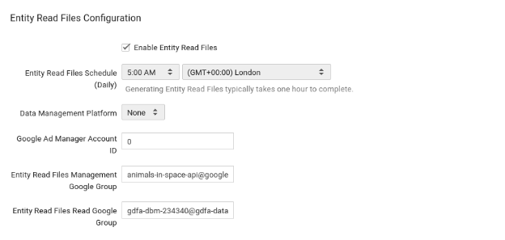
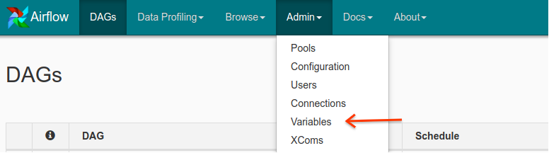

# Entity Read Files

### DV360 Entity Read File Authorization
Entity Read Files are large json files showing the state of an account. These are held in Google Cloud Storage. Access is granted via a **Google Group**.

This is found in

**Settings > Basic Details > Entity Read Files Configuration  > Entity Read Files Read Google Group**

You should add the service account to the Entity **Read** Files Read Google Group.

Add the **service account** email to this Google Group to allow it to read private entity read files.

You can find more info on Entity Read Files access here: https://developers.google.com/bid-manager/guides/entity-read/overview.

### Multiple Partners
If you are intending to use many google groups, it is also possible to set up a single Google Group containing all other Google Groups. You can then Add the Service account to this Google Group to grant access to all accounts at once

### Variables
The Entity Read File Dag will require several variables to run.

These can be set via the **Admin** section in the **Airflow UI** (accessible from the list of Composer Environments, clicking on the corresponding link under "Airflow Web server").

<table>
  <tr>
   <td><strong>Area</strong>
   </td>
   <td><strong>Variable Name</strong>
   </td>
   <td><strong>Value</strong>
   </td>
   <td><strong>Needed For</strong>
   </td>
  </tr>
  <tr>
   <td>Cloud Project
   </td>
   <td><strong>gce_zone</strong>
   </td>
   <td><a href="https://cloud.google.com/compute/docs/regions-zones/">Your Google Compute Engine Zone </a>(you can find it under "Location" in the list of Composer Environments)
   </td>
   <td>All
   </td>
  </tr>
  <tr>
   <td>Cloud Project
   </td>
   <td><strong>gcs_bucket</strong>
   </td>
   <td>The Cloud Storage bucket for your Airflow DAGs (you can find a link to the bucket in the Environments page - see Image1)
   </td>
   <td>All
   </td>
  </tr>
  <tr>
   <td>Cloud Project
   </td>
   <td><strong>cloud_project_id</strong>
   </td>
   <td>The Project ID you can find in your GCP console homepage.
   </td>
   <td>All
   </td>
  </tr>
  <tr>
   <td>BigQuery
   </td>
   <td><strong>erf_bq_dataset</strong>
   </td>
   <td>The name of the BigQuery Dataset you wish to use - see image2 and documentation <a href="https://cloud.google.com/bigquery/docs/datasets">here</a>.
   </td>
   <td>ERFs
   </td>
  </tr>
  <tr>
   <td>DV360
   </td>
   <td><strong>partner_ids</strong>
   </td>
   <td>The list of partners ids from DV360, used for Entity Read Files, comma separated.
   </td>
   <td>All
   </td>
  </tr>
  <tr>
   <td>DV360
   </td>
   <td><strong>private_entity_types</strong>
   </td>
   <td>A comma separated list of Private Entity Read Files you would like to import.
   </td>
   <td>ERFs
   </td>
  </tr>
  <tr>
   <td>DV360
   </td>
   <td><strong>sequential_erf_dag_name</strong>
   </td>
   <td>The name of your dag as it will show up in the UI. Name it whatever makes sense for you (alphanumeric characters, dashes, dots and underscores exclusively).
   </td>
   <td>ERFs
   </td>
  </tr>
  <tr><table>
